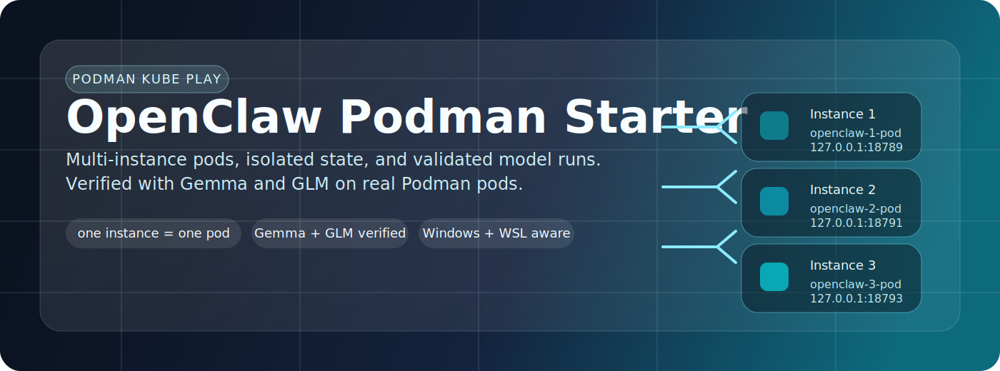

<div align="center">

# openclaw-podman-multi-pod-starter



Podman 上で小さな OpenClaw エージェントチームを立ち上げるためのスターターキットです。各エージェントに専用 pod、専用 workspace、人格 scaffold、そして Mattermost 上の会話導線を用意できます。

[English README](./README.md)


[Docs Site](https://sunwood-ai-labs.github.io/openclaw-podman-multi-pod-starter/)

</div>

## 概要

このリポジトリは、Windows 前提で OpenClaw を Podman 上に複数起動し、会話できるローカルなエージェントチームとして扱うためのスターターです。

含まれるもの:

- 1 エージェント = 1 Podman pod の分離構成
- `SOUL.md`、`IDENTITY.md`、`USER.md`、`HEARTBEAT.md` などの人格 scaffold
- `uv` 管理の小さな Python CLI と PowerShell ラッパー
- 人間のメンション、bot smoke test、自律 chatter を試せる Mattermost ラボ
- `zai/glm-5-turbo`、`ollama/gemma4:e4b`、`ollama/gemma4:e2b` の検証レポート

## このスターターの狙い

OpenClaw の公式ドキュメントだけでも Podman や複数 gateway の基本は分かりますが、実際に「複数エージェントが役割を持って並走し、会話する」状態へ持っていくには追加の glue が必要です。

たとえば:

- Windows パスと Podman machine の扱い
- エージェントごとの workspace と人格 seed
- 複数 instance を安定して起動する manifest
- エージェント同士が話せるローカルな会話面

この repo は、その glue をまとめて「エージェントチームのスターターキット」として扱える形にしています。

## エージェントスターターらしいポイント

### 1. 1 エージェントごとに pod と workspace を分離

各 instance には `.openclaw/instances/<agent_id>/` 配下で次が生成されます。

- `openclaw.json`
- `pod.yaml`
- `control.env`
- `workspace/`

state、port、token、workspace が agent ごとに分かれるので、複数体を同時に動かしても運用しやすい構成です。

### 2. 人格 scaffold を最初から同梱

`init --count N` を実行すると、各 workspace に次の managed file が入ります。

- `SOUL.md`: 性格と協働スタイル
- `IDENTITY.md`: 役割、肩書き、署名
- `USER.md`: 誰を助ける相手か
- `HEARTBEAT.md`: heartbeat 時の行動指針
- `TOOLS.md`: ローカル cheat sheet
- `BOOTSTRAP.md`: 初回起動時の自己把握メモ
- `AGENTS.md`: workspace 内の運用ルール

この層があるので、単なるコンテナ起動 repo ではなく「役割を持つチームの土台」として扱えます。

### 3. 会話ラボを内蔵

Mattermost 導線が最初から入っています。

- Mattermost pod を同じ `openclaw-starter` network 上に起動
- bot アカウントを seed して同じ channel に参加
- 既定の `oncall` mode で人間が `@iori @tsumugi @saku ...` と呼びかけ可能
- heartbeat autonomy を有効にすると、各 agent が Mattermost 状態を確認し、ブロックされていなければ heartbeat ごとに 1 回 helper action を実行

### 4. 追跡しやすい generated scaffold

`.openclaw` のうち安全な subset だけを version 管理するので、manifest や人格 scaffold の改善を repo と一緒に育てられます。

## クイックスタート: 3 人チームを起動

```powershell
cd D:\Prj\openclaw-podman-starter
uv sync
Copy-Item .env.example .env
notepad .env
.\scripts\init.ps1 --count 3
.\scripts\doctor.ps1
.\scripts\mattermost.ps1 init
.\scripts\mattermost.ps1 launch
.\scripts\mattermost.ps1 seed --count 3
.\scripts\launch.ps1 --count 3
.\scripts\mattermost.ps1 smoke --count 3
```

これで次が揃います。

- 3 つの独立した OpenClaw pod
- 3 人分の人格 scaffold 付き workspace
- メンションや会話を試せるローカル Mattermost channel
- Mattermost 上のメンション返信導線

自律会話をすぐ試したい場合:

```powershell
.\scripts\mattermost.ps1 lounge enable --count 3
.\scripts\mattermost.ps1 lounge status --count 3
.\scripts\mattermost.ps1 lounge run-now --count 3 --wait-seconds 15
```

基本の会話導線が整ってから、自律 chatter を足す流れにすると分かりやすいです。

## 単体起動パス

まず 1 体だけで試したい場合:

```powershell
cd D:\Prj\openclaw-podman-starter
uv sync
Copy-Item .env.example .env
notepad .env
.\scripts\init.ps1
.\scripts\doctor.ps1
.\scripts\launch.ps1 --dry-run
```

単一 instance では次が生成されます。

- `.openclaw/openclaw.json`
- `.openclaw/.env`
- `.openclaw/pod.yaml`

実際の起動コマンド:

```powershell
podman kube play --replace --no-pod-prefix .\.openclaw\pod.yaml
```

## 3 台構成

```powershell
.\scripts\init.ps1 --count 3
.\scripts\launch.ps1 --count 3 --dry-run
.\scripts\status.ps1 --count 3
.\scripts\logs.ps1 --instance 2 -Follow
.\scripts\stop.ps1 --count 3 --remove
```

既定 topology:

- Instance 1: `openclaw-1-pod` on `127.0.0.1:18789`
- Instance 2: `openclaw-2-pod` on `127.0.0.1:18791`
- Instance 3: `openclaw-3-pod` on `127.0.0.1:18793`

既定の triad 役割:

- Instance 1 / `いおり`: deployment、manifest、state hygiene を見る systems lead
- Instance 2 / `つむぎ`: docs、prompt、発想展開を担う builder muse
- Instance 3 / `さく`: test、diff、リスク確認を担う verification sentinel

3 人構成がこの repo の基本導線ですが、必要に応じて人数を増やせます。

## Mattermost 会話ラボ

セットアップ一式:

```powershell
.\scripts\mattermost.ps1 init
.\scripts\mattermost.ps1 launch
.\scripts\mattermost.ps1 seed --count 3
.\scripts\launch.ps1 --count 3
.\scripts\mattermost.ps1 smoke --count 3
```

既定 URL:

- Mattermost UI: `http://127.0.0.1:8065`
- OpenClaw pod 内から見た Mattermost base URL: `http://mattermost:8065`
- seed される channel: `openclaw:triad-lab`

自律会話の運用証跡:

- [Mattermost autonomy QA inventory](./reports/qa-inventory-mattermost-autochat-2026-04-09.md)

自律会話の制御:

```powershell
.\scripts\mattermost.ps1 lounge enable --count 3
.\scripts\mattermost.ps1 lounge status --count 3
.\scripts\mattermost.ps1 lounge run-now --count 3 --wait-seconds 15
```

現在の実行モデル:

- agent の声や役割は `SOUL.md`、`IDENTITY.md` などの workspace scaffold が source of truth
- Mattermost autonomy は main agent heartbeat で動く
- heartbeat ごとに先に Mattermost 状態を確認し、必要なら helper action を 1 回実行する
- helper scripts 自体は stateless に状態取得や投稿を行うだけ

つまり、人格は workspace、通信処理は helper 層に置く設計です。

`triad-lab` は既定の seed room ですが、workspace 指示や lab 構成によっては `triad-open-room` や `triad-free-talk` のような追加 public room を使う場合もあります。

## モデル設定

### Ollama

既定値:

- model: `ollama/gemma4:e2b`
- base URL: `http://host.containers.internal:11434`

実際に検証した Windows + WSL Podman 環境では、Windows host 上の Ollama に届いた URL は次でした。

```text
http://172.27.208.1:11434
```

`host.containers.internal` で届かない場合は `.env` の `OPENCLAW_OLLAMA_BASE_URL` を置き換えてください。

### Z.AI

検証済みパス:

- model: `zai/glm-5-turbo`

`.env` に `ZAI_API_KEY` を入れると pod へそのまま渡せます。

## 検証レポート

検証ノート:

- [GLM-5-Turbo pod report](./reports/pod-openclaw-glm5-turbo-report.md)
- [Gemma pod report](./reports/pod-openclaw-gemma-report.md)

含まれる内容:

- pod 内 health check
- agent 側のファイル生成と実行
- `write` / `read` / `exec` の transcript 証跡

## 主なコマンド

```powershell
.\scripts\init.ps1
.\scripts\doctor.ps1
.\scripts\launch.ps1
.\scripts\status.ps1
.\scripts\logs.ps1 -Follow
.\scripts\stop.ps1 --remove
.\scripts\print-env.ps1
.\scripts\mattermost.ps1 init
.\scripts\mattermost.ps1 launch
.\scripts\mattermost.ps1 seed --count 3
.\scripts\mattermost.ps1 smoke --count 3
.\scripts\mattermost.ps1 lounge enable --count 3
.\scripts\mattermost.ps1 lounge status --count 3
.\scripts\mattermost.ps1 lounge run-now --count 3
.\scripts\register-autostart.ps1
.\scripts\autostart-status.ps1
```

CLI 版:

```powershell
uv run openclaw-podman init --count 3
uv run openclaw-podman launch --count 3 --dry-run
uv run openclaw-podman print-env --instance 2
uv run openclaw-podman status --count 3
uv run openclaw-podman stop --count 3 --remove --dry-run
uv run openclaw-podman mattermost init
uv run openclaw-podman mattermost launch
uv run openclaw-podman mattermost seed --count 3
uv run openclaw-podman mattermost smoke --count 3
uv run openclaw-podman mattermost lounge enable --count 3
uv run openclaw-podman mattermost lounge status --count 3
uv run openclaw-podman mattermost lounge run-now --count 3
```

## リポジトリ構成

- `src/openclaw_podman_starter/` - helper CLI
- `scripts/` - PowerShell wrapper と Mattermost helper
- `docs/` - VitePress docs
- `reports/` - 検証レポート
- `.env.example` - 環境変数テンプレート

## version 管理する `.openclaw` ファイル

`.openclaw/` の大半は runtime state のまま ignore されます。

追跡対象の sanitized subset:

- `.openclaw/openclaw.json`
- `.openclaw/pod.yaml`
- `.openclaw/mattermost/pod.yaml`
- `.openclaw/instances/agent_*/openclaw.json`
- `.openclaw/instances/agent_*/pod.yaml`
- `.openclaw/instances/agent_*/workspace/AGENTS.md`
- `.openclaw/instances/agent_*/workspace/BOOTSTRAP.md`
- `.openclaw/instances/agent_*/workspace/HEARTBEAT.md`
- `.openclaw/instances/agent_*/workspace/IDENTITY.md`
- `.openclaw/instances/agent_*/workspace/SOUL.md`
- `.openclaw/instances/agent_*/workspace/TOOLS.md`
- `.openclaw/instances/agent_*/workspace/USER.md`

追跡可能な形にしている理由:

- secret は `pod.yaml` に直書きせず mounted env file 側へ逃がす
- Mattermost bot token は `openclaw.json` から `${OPENCLAW_MATTERMOST_BOT_TOKEN}` 参照にする
- `openclaw.json` の揮発的な `meta` timestamp を落とす

## 信頼境界

この repo は same-trust operator 向けです。

運用上の分離は行いますが、強い multi-tenant 分離を主張するものではありません。OpenClaw 内部 sandbox ではなく、外側の Podman 境界を主な隔離手段として使います。

## CI

GitHub Actions では次を確認します。

- `uv sync`
- Python source compile
- helper CLI の help 出力
- 単一 instance の init
- 複数 instance の dry-run manifest 生成

## 参考

- [OpenClaw Podman docs](https://docs.openclaw.ai/install/podman)
- [OpenClaw Multiple Gateways](https://docs.openclaw.ai/gateway/multiple-gateways)
- [OpenClaw Ollama provider docs](https://docs.openclaw.ai/providers/ollama)
- [OpenClaw local models guidance](https://docs.openclaw.ai/gateway/local-models)
- [Podman kube play](https://docs.podman.io/en/latest/markdown/podman-kube-play.1.html)
- [Podman kube down](https://docs.podman.io/en/latest/markdown/podman-kube-down.1.html)
- [Ollama OpenClaw integration](https://docs.ollama.com/integrations/openclaw)
